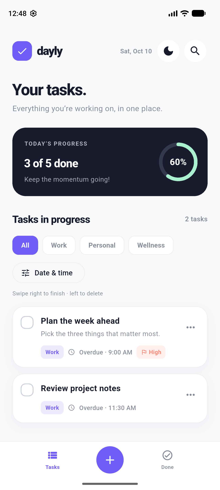
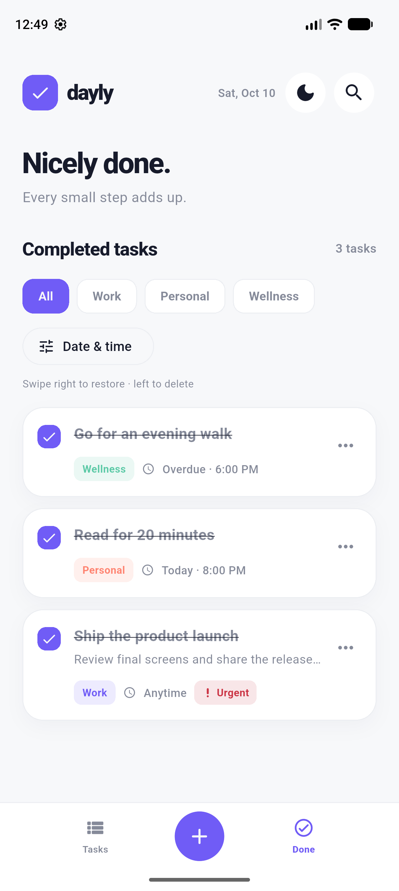
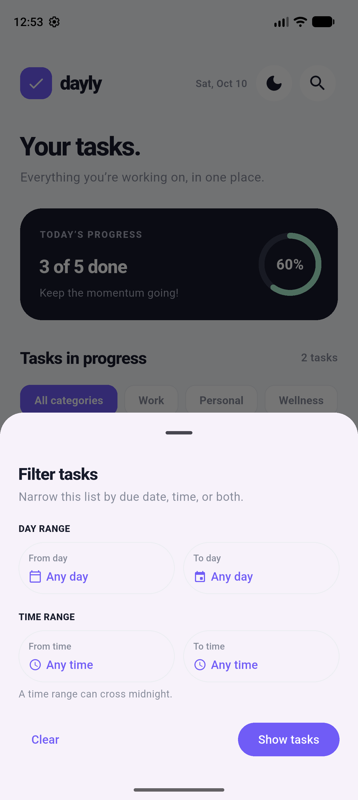
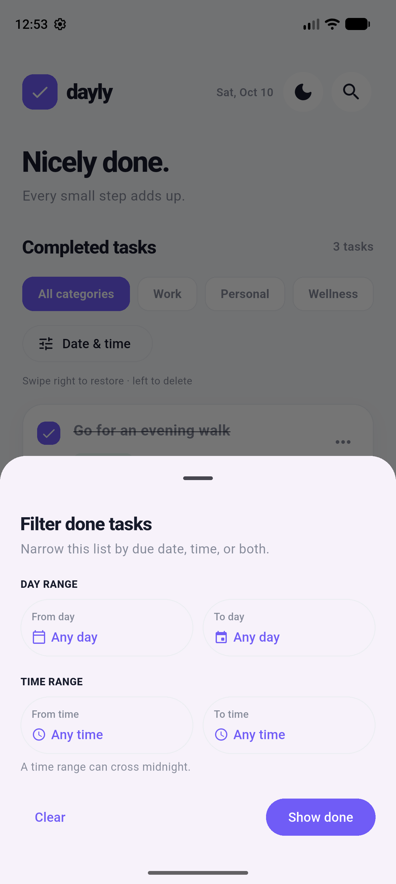
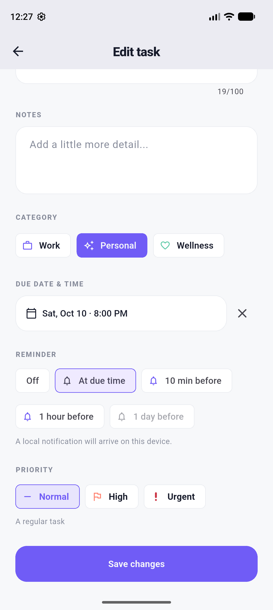
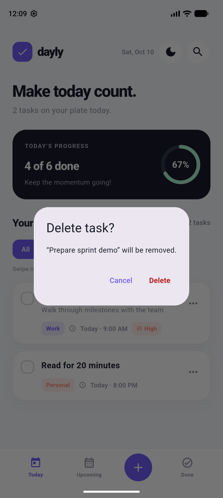
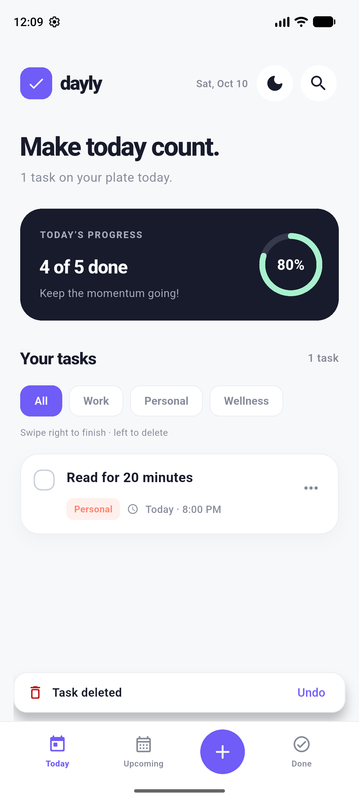
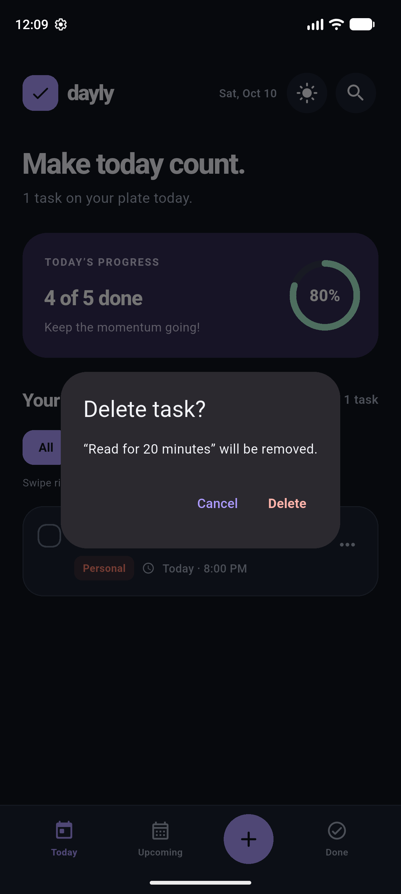
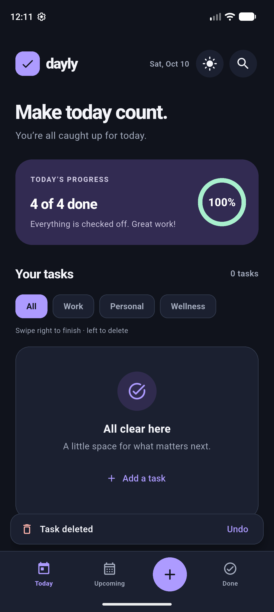

# Dayly

A clean, responsive todo app for Android and iPhone, built with Flutter.

## Features

- Tasks and Done views: unfinished work stays in Tasks regardless of due date
- Day and time range filters that can be combined within either view
- Add, edit, complete, and delete tasks
- Categories, Normal/High/Urgent priority, notes, due dates, and times
- Search and category filters
- Swipe right to complete or restore, swipe left to delete, and undo either action
- Clear in-app feedback after saving, completing, restoring, and deleting
- Delete confirmation and processing-aware Save/Delete buttons
- Animated progress feedback
- Persistent light and dark mode toggle
- Responsive portrait and landscape layouts for phones
- Local task storage with `shared_preferences`
- Optional on-device reminders for tasks with a future due date and time

The app opens with a few editable example tasks on first launch. After that, it restores your saved tasks, including an empty list if you delete them all.

## See it in action

These screens were captured from the Android app with example tasks. The same Flutter interface is designed for iPhone as well. Screens farther down show earlier versions of the navigation and remain here as an update history.

### Current navigation

**Tasks** holds every unfinished task, whether it is overdue, due today, scheduled later, or has no due date. **Done** holds completed tasks. The **+** button is available from either view.

| Tasks | Done |
|:---:|:---:|
|  |  |

### Find the right time

Open **Tasks** or **Done**, then **Date & time** to find tasks due on a day, between days, between hours, or with both ranges together. Time ranges can cross midnight. Search and category filters still work alongside the date and time filter.

| Filter Tasks | Filter Done |
|:---:|:---:|
|  |  |

The [earlier filter screenshot](docs/screenshots/time-filter.png) remains available.

### Get a reminder

When editing a task with a future due date, choose **At due time**, **10 min before**, **1 hour before**, or **1 day before**. Reminders are off by default, and the app asks for notification permission when you first enable one. Completing, deleting, or changing a task updates its local reminder. Android may delay delivery slightly to conserve battery.



### Latest update: clearer actions

Save and Delete show a busy indicator and disable repeat taps while the change is stored. Deleting from the task menu asks for confirmation; the result appears with an **Undo** action. The controls also adapt to dark mode.

[Watch confirmation and feedback in both themes (MP4)](docs/dayly-confirmation-feedback.mp4). The [earlier interaction demo](docs/dayly-update.mp4) remains available.

| Theme | Delete confirmation | Feedback with Undo |
|:---:|:---:|:---:|
| Light |  |  |
| Dark |  |  |

### Earlier Today dashboard

Urgent tasks appear before High and Normal tasks. The progress ring updates as you complete them, and the theme button switches between light and dark mode.

| Light mode | Dark mode and live progress |
|:---:|:---:|
|  |  |

### Plan and prioritize

Tap **+** to add a task. Give it a title, optional notes, a category, a due date and time, and a Normal, High, or Urgent priority. For example, *Ship the product launch* is Urgent; *Prepare sprint demo* is High and due tomorrow morning. Both appear in **Tasks** until completed. The earlier Upcoming screenshot is kept below for reference.

| Urgent task | Scheduled task | Earlier Upcoming view |
|:---:|:---:|:---:|
|  |  |  |

### Find and manage tasks

Use **Search** to match task titles or notes; searching for *plan* finds both the launch task's notes and the weekly plan. Tap a category chip to narrow the list. Open **•••** to edit a task or choose Delete.

| Search titles and notes | Filter by category | Task actions | Edit a task |
|:---:|:---:|:---:|:---:|
|  |  |  |  |

### Finish, restore, or undo

Tap a checkbox or swipe right to complete a task. Swipe left to delete it. The **Undo** action reverses a swipe, and the **Done** view lets you restore completed tasks.


### Rotate freely

Portrait uses bottom navigation. In landscape, a side bar appears and the dashboard and task list sit side by side. Both orientations work in light and dark mode.

| Landscape light | Landscape dark |
|:---:|:---:|
|  |  |

Tasks and the selected theme are saved locally and restored when the app reopens.

## Project structure

```text
lib/
  constants/  Shared layout values and storage keys
  controllers/ Task actions and home filter state
  data/       SharedPreferences adapters and app state
  enums/      Navigation, task, and UI enum subfolders
  extensions/ Category, priority, reminder, and progress presentation
  interfaces/ Storage and reminder contracts
  mappers/    JSON conversion for task storage
  models/     Task, progress, and filter data only
  screens/    Dashboard and task editor
  services/   Task queries, reminders, feedback, and first-launch examples
  theme/      Light/dark palettes and Material themes
  utils/      Date formatting and stable notification IDs
  widgets/    common/, dialogs/, filters/, home/, task_card/, task_editor/, theme/
```

## Run

```sh
flutter pub get
flutter run
```

Use an Android emulator/device or an iPhone simulator/device with the appropriate Flutter platform tooling installed. Run `flutter analyze` and `flutter test` to check the project.

Run `dart run tool/check_source_lines.dart` to enforce the 250-line limit for authored Dart files.
