# Dayly

A clean, responsive todo app for Android and iPhone, built with Flutter.

## Features

- Today, Upcoming, and Completed views
- Add, edit, complete, and delete tasks
- Categories, Normal/High/Urgent priority, notes, due dates, and times
- Search and category filters
- Swipe right to complete or restore, swipe left to delete, and undo either action
- Animated progress feedback
- Persistent light and dark mode toggle
- Responsive portrait and landscape layouts for phones
- Local task storage with `shared_preferences`

The app opens with a few editable example tasks on first launch. After that, it restores your saved tasks, including an empty list if you delete them all.

## See it in action

These screens were captured from the Android app with example tasks. The same Flutter interface is designed for iPhone as well.

### Focus on today

Urgent tasks appear before High and Normal tasks. The progress ring updates as you complete them, and the theme button switches between light and dark mode.

| Light mode | Dark mode and live progress |
|:---:|:---:|
| 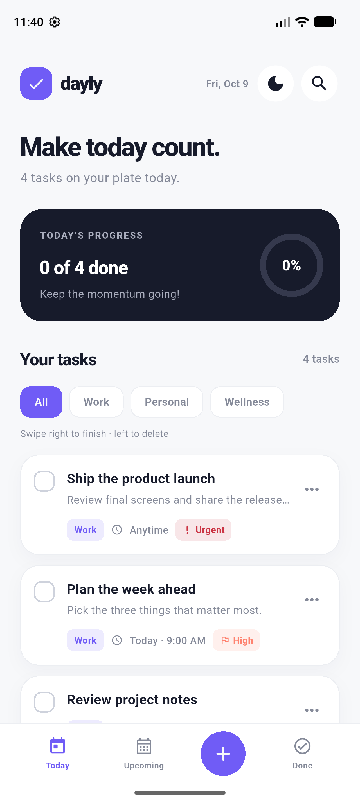 | 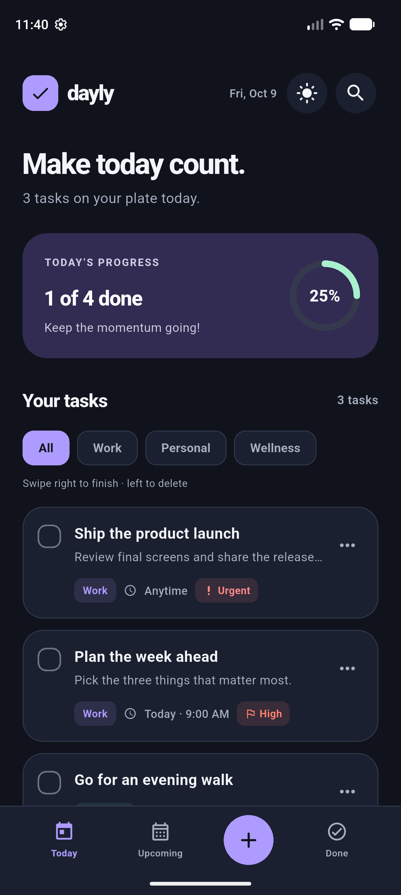 |

### Plan and prioritize

Tap **+** to add a task. Give it a title, optional notes, a category, a due date and time, and a Normal, High, or Urgent priority. For example, *Ship the product launch* is Urgent; *Prepare sprint demo* is High and due tomorrow morning. The **Upcoming** view keeps future work separate from Today.

| Urgent task | Scheduled task | Upcoming view |
|:---:|:---:|:---:|
|  | 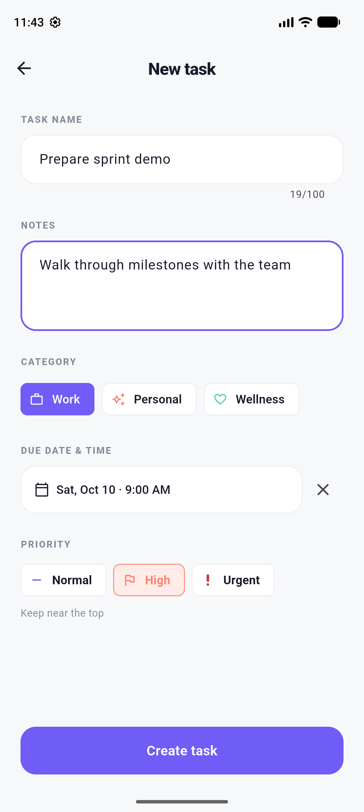 | 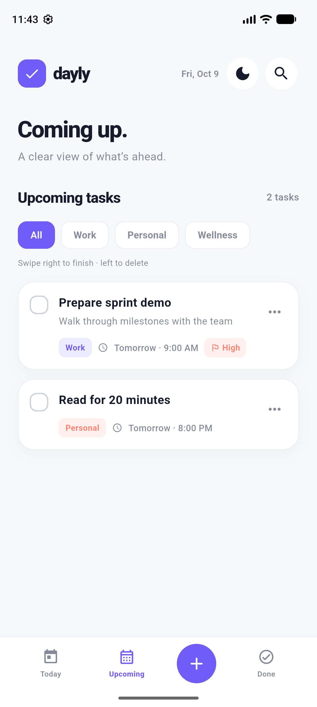 |

### Find and manage tasks

Use **Search** to match task titles or notes; searching for *plan* finds both the launch task's notes and the weekly plan. Tap a category chip to narrow the list. Open **•••** to edit a task or choose Delete.

| Search titles and notes | Filter by category | Task actions | Edit a task |
|:---:|:---:|:---:|:---:|
| 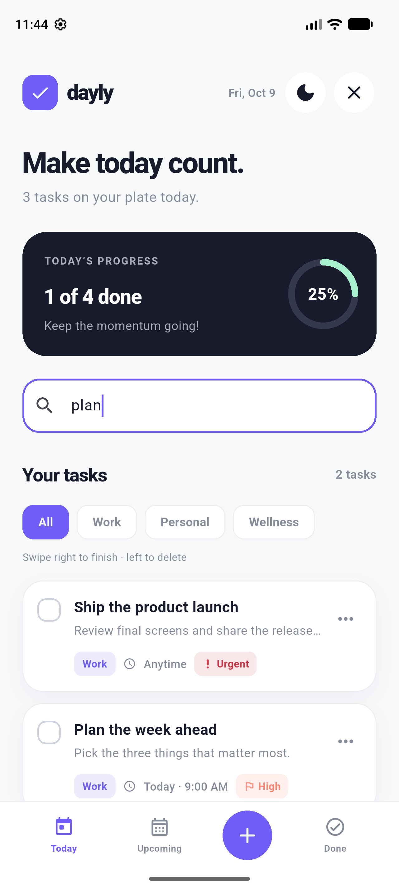 | 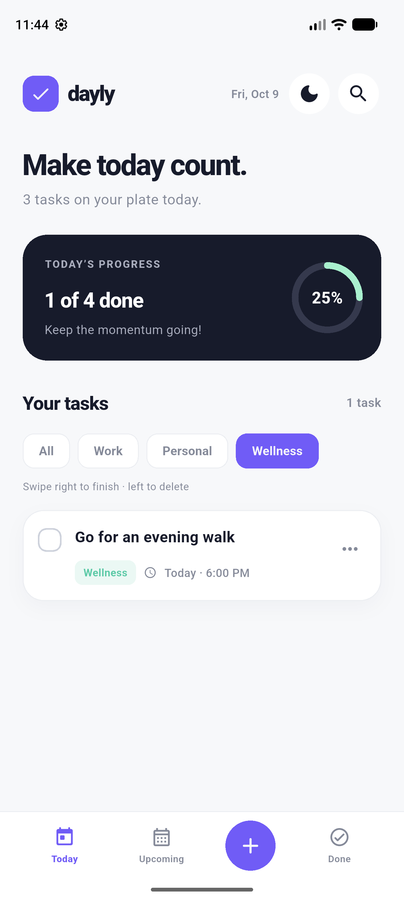 | 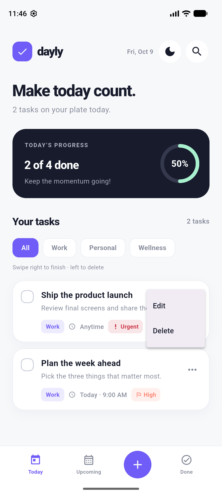 | 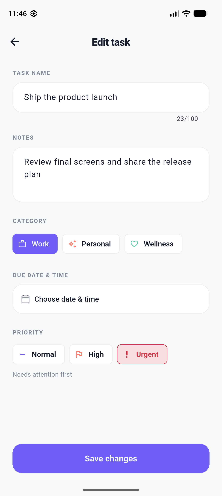 |

### Finish, restore, or undo

Tap a checkbox or swipe right to complete a task. Swipe left to delete it. The **Undo** action reverses a swipe, and the **Done** view lets you restore completed tasks.

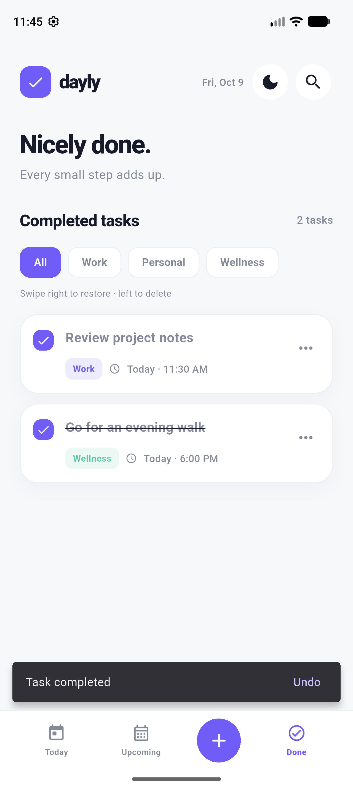

### Rotate freely

Portrait uses bottom navigation. In landscape, a side bar appears and the dashboard and task list sit side by side. Both orientations work in light and dark mode.

| Landscape light | Landscape dark |
|:---:|:---:|
| 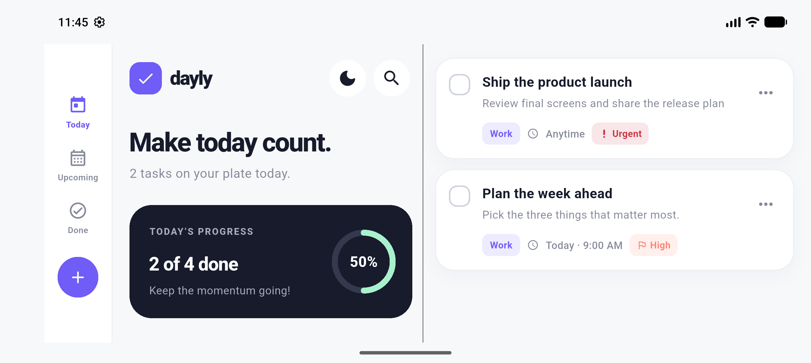 | 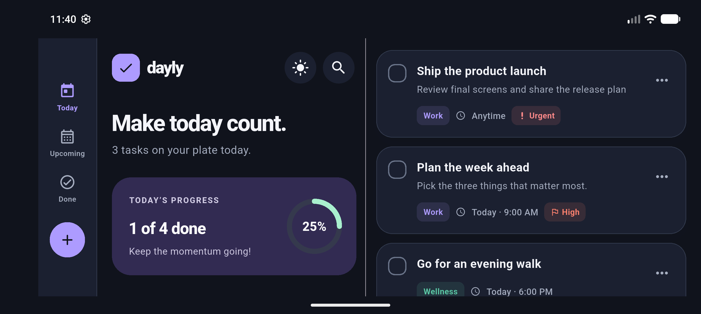 |

Tasks and the selected theme are saved locally and restored when the app reopens.

## Project structure

```text
lib/
  constants/  Shared layout values and storage keys
  data/       SharedPreferences adapters and app state
  enums/      Navigation and task enum subfolders
  extensions/ Category and priority presentation, derived progress values
  interfaces/ Task and theme storage contracts
  mappers/    JSON conversion for task storage
  models/     Task and progress data only
  screens/    Dashboard and task editor
  services/   Task queries and first-launch examples
  theme/      Light/dark palettes and Material themes
  utils/      Date formatting
  widgets/    home/, task_card/, task_editor/, and theme/ components
```

## Run

```sh
flutter pub get
flutter run
```

Use an Android emulator/device or an iPhone simulator/device with the appropriate Flutter platform tooling installed. Run `flutter analyze` and `flutter test` to check the project.

Run `dart run tool/check_source_lines.dart` to enforce the 250-line limit for authored Dart files.
